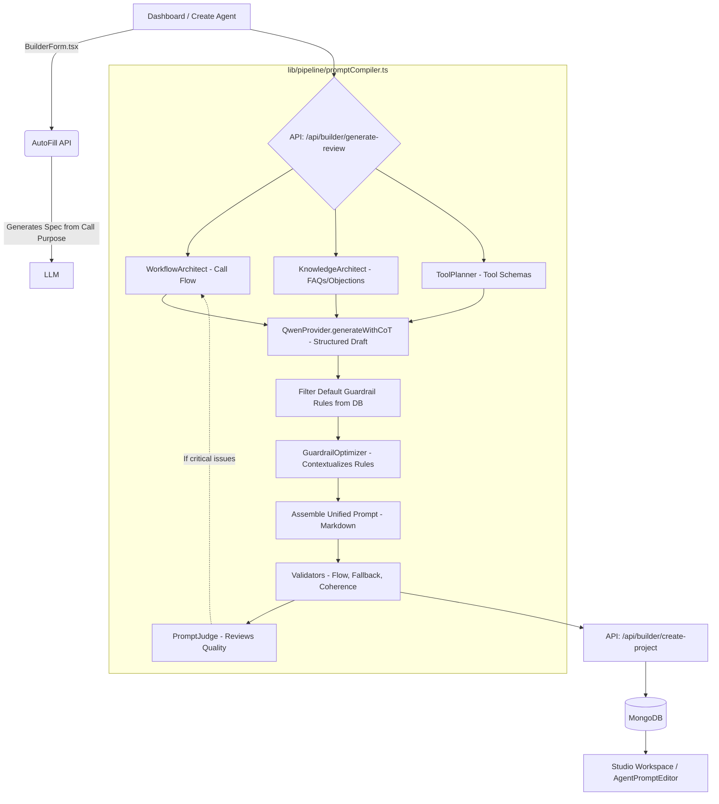

# Voice Agent Prompt Builder


**An intelligent builder that transforms discovery conversations into production-ready system prompts for AI telephony agents.**

## The Why

Building system prompts for voice AI agents (like Bland, Retell, Vapi) is a complex, trial-and-error process. Getting the right mix of call flows, knowledge constraints, and tools often takes hours of manual tweaking. **Voice Agent Prompt Builder** solves this by leveraging an LLM to automate the prompt engineering process. Through a short, guided discovery conversation, it extracts your business needs and deterministically compiles a robust, production-ready system prompt package—saving you hours of manual work and ensuring high-quality, reliable agent behavior.

## Architecture

Here is how the UI, compiler, planners, and validators interact under the hood:



## Codebase Organization

Navigating the repository:

- **/app/api**: Contains the Next.js Route Handlers. Subfolders include `/api/builder` (for autofill, review generation, parsing) and `/api/projects` (for saving and fetching workspaces).
- **/app/dashboard**: The projects dashboard and landing view.
- **/app/project/[projectId]**: The Studio workspace page where the generated prompt package is refined, tested, and versioned.
- **/components/dashboard**: Dashboard UI components, including the `CreateAgentModal.tsx`.
- **/components/project**: Core builder components like `BuilderForm.tsx` (the step-by-step specification form) and `AgentPromptEditor.tsx` (for editing the compiled result).
- **/lib/pipeline**: The core orchestration layer (`promptCompiler.ts`), which coordinates the compiler modules, validators, and the LLM-powered judge.
- **/lib/compiler**: Contains specialized AI architects (`WorkflowArchitect`, `KnowledgeArchitect`, `ToolPlanner`) and the deterministic prompt assembler.

## Stack

- **Next.js 16** (App Router, Route Handlers) + **React 19**
- **MongoDB** via **Prisma 6**
- **Qwen** LLM through an **OpenAI-compatible** endpoint (vLLM / Ollama / hosted)
- **Tailwind 4**, `react-hook-form` + `zod`
- **Vitest** for tests

## Getting Started

### Prerequisites
- **Node 20+**
- Running **MongoDB** instance
- **Qwen** (OpenAI-compatible) endpoint

### Installation & Setup

1. **Clone and Install dependencies**
   ```bash
   npm install
   ```

2. **Environment Variables**
   Create a `.env` file based on the example:
   ```bash
   cp .env.example .env
   ```
   Fill in your values:
   ```env
   DATABASE_URL="mongodb://localhost:27017/autoprompt"
   QWEN_BASE_URL_FOR_LLM="http://localhost:8000/v1"
   QWEN_API_KEY="EMPTY"
   QWEN_MODEL="Qwen/Qwen3.6-35B-A3B-FP8"
   # ... add your ATLAS keys if using MongoDB Atlas
   ```

3. **Database Setup**
   Generate Prisma client, push schema, and seed default rules:
   ```bash
   npx prisma generate
   npx prisma db push
   npm run prisma:seed
   ```

4. **Run the Application**
   ```bash
   npm run dev
   ```
   Navigate to `http://localhost:3000` to start using the builder.

### Common Usage Scenario
1. Open the builder (`http://localhost:3000`).
2. Start a conversation to describe your voice agent's purpose (e.g., "I need a customer support agent for my bakery").
3. The system's **CoverageArchitect** will identify gaps and prompt you for more details (like opening hours, FAQs, and booking tools).
4. Once the specification is complete, the compiler generates a ready-to-use markdown prompt that you can export or copy-paste directly into your preferred telephony provider.

## Security Hardening
This platform is hardened for secure enterprise use. Key security measures include:
- **HTTP Basic Authentication:** Site-wide lockout capability using `TESTING_USERNAME` and `TESTING_PASSWORD` environment variables (handled via Next.js Proxy/Middleware).
- **IDOR / BOLA Prevention:** Strict ownership assertion mechanisms for sessions and projects across all backend API routes.
- **Input Validation:** Incoming request payloads are validated using strict Zod schemas to prevent NoSQL injection and ensure data integrity.
- **LLM Prompt Injection Protections:** Critical methods isolate user inputs (like `caller_message`) using XML delimiters within the LLM context to prevent prompt injection and unauthorized overrides.
- **Secure Data Queries:** Optimized Prisma queries explicitly select non-sensitive fields to prevent data leakage.

## Scripts

| Script | Purpose |
|---|---|
| `npm run dev` / `build` / `start` | Next.js dev / production build / serve |
| `npm run lint` | ESLint |
| `npm run typecheck` | `tsc --noEmit` |
| `npm test` | Vitest (unit). Set `RUN_LLM_TESTS=1` to include the live compile smoke test |
| `npm run prisma:seed` | Seed default rules |
| `npm run db:reset` | Push schema (data loss) + reseed |

CI (`.github/workflows/ci.yml`) runs lint → typecheck → test → build on every push and PR.
